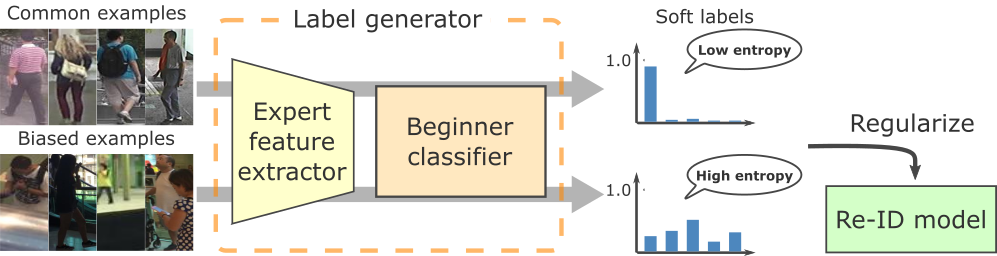

# BCaR: Beginner Classifier as Regularization Towards Generalizable Re-ID
Official repository of our BMVC2020 paper.
The code is implemented by PyTorch and some other libraries.



## Requirements
Experiments were conducted on Ubuntu 18.04 with Python 3.6 and PyTorch v1.3.1. You can install the dependencies by the following command:
```
pip install -r requirements.txt
```

## Training and test
### 1. Data preparation
In our experiments, the following datasets are used for the training and test:
- CUHK02
- CUHK03
- Market1501
- DukeMTMC-reID
- PersonSearch
- VIPeR
- PRID
- GRID
- i-LIDS

Download and extract all the datasets and place them to `data/original`. For training, the data have to be relocated. Using the following command, the data are automatically relocated:
```
./scripts/relocate_dataset.sh
```
Note that some of the datasets might be removed from the Internet. We cannot provide them so please ask the dataset authors about the status.
### 2. Start training and test
We have prepared the training scripts for each of the experiments described in our paper. You can use them if the data are relocated by our script. If not, change the `train_targets` and `test_targets` options. Our scripts can be used as follows:
#### Domain generalization setting with the MobileNetV2 backbone
```
./scripts/train_mobilenet_v2.sh
```
#### Domain generalization setting with the ResNet50 backbone
```
./scripts/train_resnet50.sh
```
#### Supervised setting for Market1501
```
./scripts/train_market.sh
```
#### Supervised setting for DukeMTMC-reID
```
./scripts/train_duke.sh
```

The tests are carried out at the end of each epoch.

### 3. Check results
Training and test results are saved to the directory specified at the start of training with the `log_path` option. You can check the results with Tensorboard. For example, if the option is set to `logs_mobilenet_v2`, you can start Tensorboard with the following command:
```
tensorboard --logdir logs_mobilenet_v2
```

## Results
### Domain generalization setting
For each dataset, the rank-1 accuracy is shown.

#### MobileNetV2 backbone

|| VIPeR | PRID | GRID | i-LIDS |
| :--- | :---: | :---: | :---: | :---: |
|[DIMN](https://openaccess.thecvf.com/content_CVPR_2019/html/Song_Generalizable_Person_Re-Identification_by_Domain-Invariant_Mapping_Network_CVPR_2019_paper.html)| 51.2 | 39.2 | 29.3 | 70.2 |
|[DualNorm](https://bmvc2019.org/wp-content/uploads/papers/0702-paper.pdf)| 53.9 | 60.4 | 41.4 | 74.8 |
|DualNorm + BCaR| **57.3** | **62.0** | **42.3** | **80.0** |

#### ResNet50 backbone

|| VIPeR | PRID | GRID | i-LIDS |
| :--- | :---: | :---: | :---: | :---: |
|[DualNorm](https://bmvc2019.org/wp-content/uploads/papers/0702-paper.pdf)| 59.4 | 69.6 | 43.7 | 78.2 |
|DualNorm + BCaR| **65.8** | **70.2** | **52.8** | **81.3** |

### Supervised setting
#### Market1501

|| Rank-1 | Rank-5 | Rank-10 | mAP |
| :--- | :---: | :---: | :---: | :---: |
|[DualNorm](https://bmvc2019.org/wp-content/uploads/papers/0702-paper.pdf)| 82.6 | 91.7 | 95.3 | 57.2 |
|DualNorm + BCaR| **87.6** | **95.5** | **97.1** | **65.7** |

#### DukeMTMC-reID

|| Rank-1 | Rank-5 | Rank-10 | mAP |
| :--- | :---: | :---: | :---: | :---: |
|[DualNorm](https://bmvc2019.org/wp-content/uploads/papers/0702-paper.pdf)| 71.2 | 82.5 | 86.3 | 48.3 |
|DualNorm + BCaR| **78.6** | **86.5** | **89.6** | **55.2** |

## Citation
Please consider citing our paper if it helps your research:
```
@inproceedings{masato_bmvc2020,
author = {Tamura, Masato and Yoshinaga, Tomoaki},
title = {BCaR: Beginner Classifier as Regularization Towards Generalizable Re-ID},
booktitle={BMVC},
year = {2020},
month = {September}
}
```

## Acknowledgement
Some of the codes are build upon [DualNorm](https://github.com/BJTUJia/person_reID_DualNorm). Thanks them for the great work!